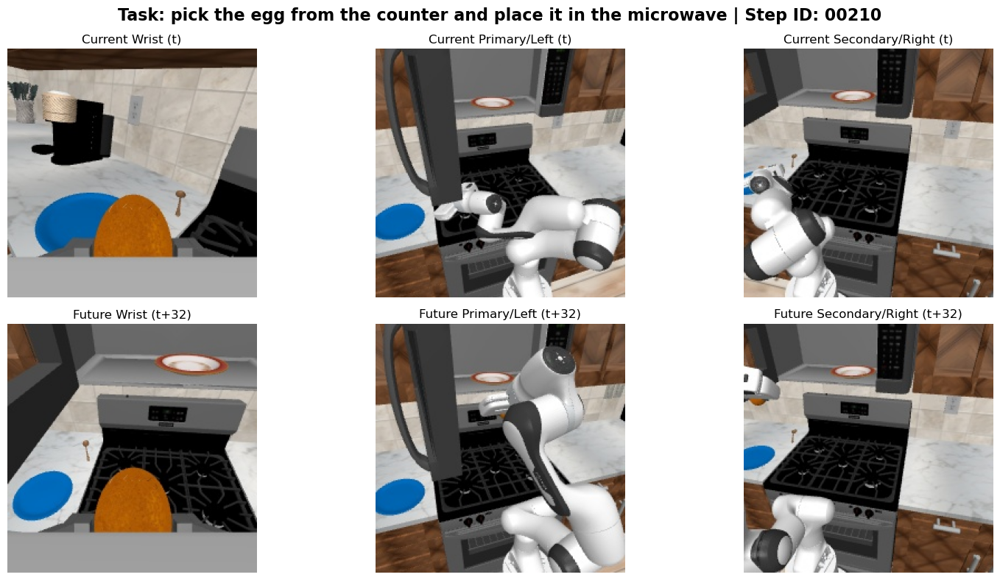

# Cosmos Policy (From-Scratch Reimplementation)

This repository is a clean, from-scratch reimplementation of **Cosmos Policy** as described in:

**Cosmos Policy: Fine-Tuning Video Models for Visuomotor Control and Planning**

Original project page (NVIDIA Research):  
https://research.nvidia.com/labs/dir/cosmos-policy/cosmos_policy_index.html


## Distributed Data Preprocessing (Ray + Webdataset)

Standard reads from raw HDF5 files bottlenecks GPU utilization. To solve this, this repository includes an optimized, distributed data ingestion pipeline. 



* Visualization of the extracted current and future state pairs for training. 

### Pipeline Architecture

* **Distributed Extraction:** Utilizes a `Ray` Producer-Consumer queue to process thousands of nested and flattened RoboCasa `.hdf5` episodes in parallel.

* **Sequential Sharding:** Converts uncompressed manipulation data into sequential `WebDataset` (`.tar`) chunks to maximize streaming speeds during training and minimize CPU loader time. 
### How to Run
To generate the WebDataset shards for your own cluster, configure the paths in `configs/config.yaml` and run:

```bash
python -m dataset.robocasaPreprocess
```


## Installation

```bash
### 1. Create the Conda Environment
conda env create -f environment.yml
conda activate cosmosPolicy

### 2. Install Python Dependencies

pip install -r requirements.txt

### 3. Install Cosmos Predict 2.5

# Install uv
curl -LsSf https://astral.sh/uv/install.sh | sh
source $HOME/.local/bin/env

# Clone and install cosmos-predict2.5
git clone https://github.com/nvidia-cosmos/cosmos-predict2.5.git
cd cosmos-predict2.5
git lfs install
git lfs pull
uv sync --extra=cu128 --active --inexact
cd ..

cd cosmos-predict2.5
pip install -e . --no-deps

### 4. Install RoboCasa
#add installation here when its time for verification 
