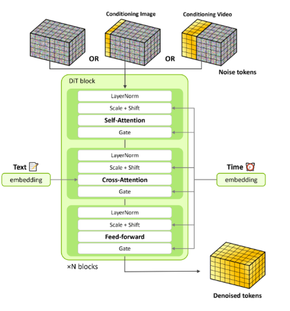
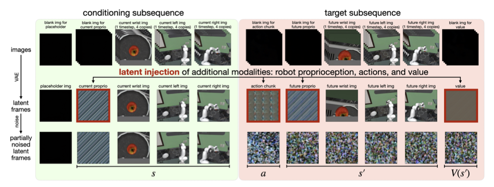
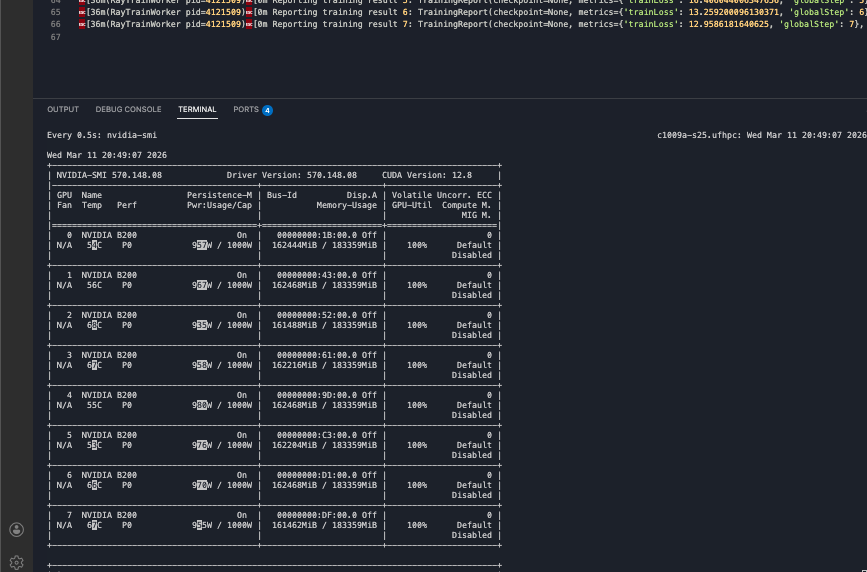
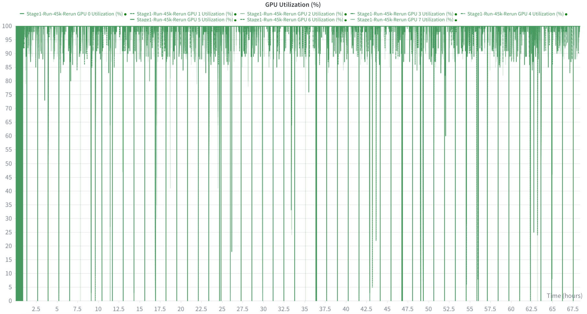
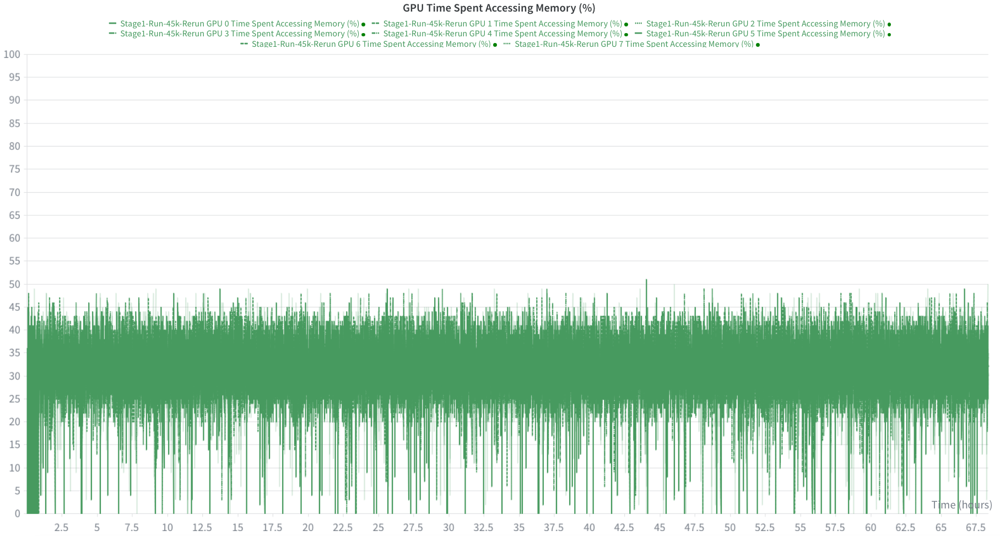
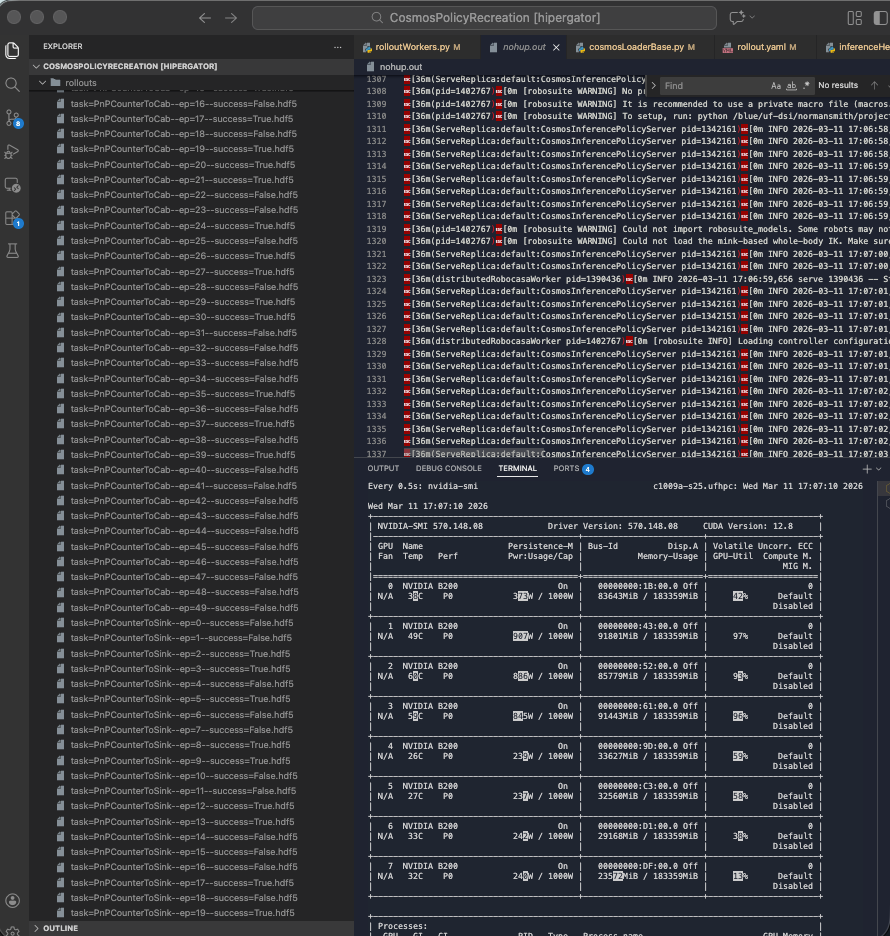
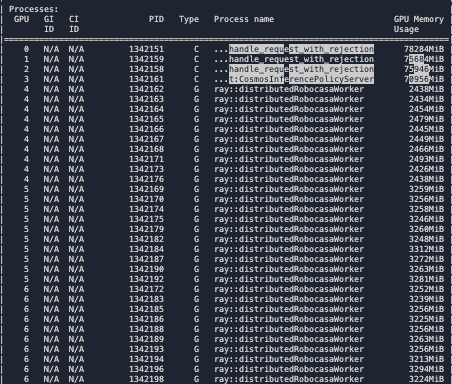
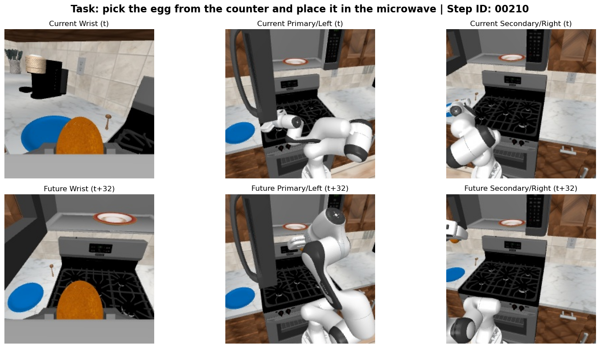
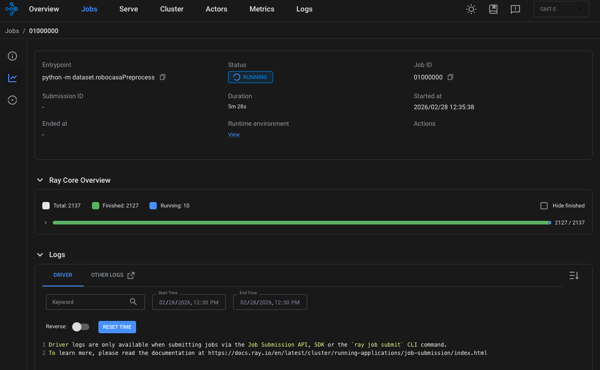

# Cosmos Policy (From-Scratch Reimplementation)

This repository is a clean, from-scratch reimplementation of **Cosmos Policy** as described in:

**Cosmos Policy: Fine-Tuning Video Models for Visuomotor Control and Planning**

Original project page (NVIDIA Research):  
https://research.nvidia.com/labs/dir/cosmos-policy/cosmos_policy_index.html


> **Developer:** Norman Smith 
> 
> **Contact:** normansmith@ufl.edu
# Results
placeholder for robo casa roll out gifs
## Evaluation Metrics
placeholder for table results 
## Training Loss Curves 
place holder for final curve results 

# Architecture

## Cosmos World Model Base

The foundation of this implementation is based on the Cosmos-Predict 2.5 World Model. This video generation model has strong physics priors from its Physical AI focused curriculum. 



*The model is trained with a conditioning mask, enabling Text2World, Image2World, and Video2World in one base model. Figure from [2].*
 
## Latent Injection 
To adapt a world-model for understanding robotic control, the latent space can be hacked through injection of robotic action sequences, camera views, and proprioception states. 

Pixel space images from multiple camera views are concatenated temporally alongside zero filled placeholder frames, creating a unified video sequence that a VAE encodes into a structured latent tensor. Both the current camera view (t) and future state (t + n) are assembled into this pixel-space sequence. 

This structured latent sequence can then be manipulated along the temporal dimension to inject action sequences, proprioception, and a value representing the temporal distance from the goal. Non visual data is injected by flattening the vector, tiling it to match the latent spatial dimensions, and reshaping it to B, 16, 1, H/8, W/8
```python 
Cosmos Predict 2.5 uses Wan 2.1 Video VAE
Formula:
B, 3, T, H, W -> B, 16, 1 + T//4, H/8, W/8

VAE Encoding :
Input:  [B, 3, 41, 224, 224]   # 41 frames, RGB
Output: [B, 16, 11, 28, 28]    # 16 latent channels,1 + T//4 temporal slots
```



*Latent Injection Diagram. Figure from [1].*

Within the 11-slot latent sequence:
* *Index 0:* Placeholder Padding for VAE
* *Index 1, 6:* Proprioception
* *Index 2-4:* Current State
* *Index 5:* Actions
* *Index 7-9:* Future State
* *Index 10:* Monte Carlo Return Value 

## Training Objective

The model is trained with a joint training scheme, enabled by the conditioning mask. During training, the model learns the policy, world model predictor, and value simultaneously. 

* 50% of the time learning the policy (example successes only)
* 25% of the time learning the world model (example of all attempts)
* 25% of the time learning the value function (example of all attempts)

The conditioning mask allows us to model the following : 
* *Policy:* Condition on current state
* *World Model:* Condition on current state and actions
* *Value Function:* Condition on current state, actions, and future state. 

Using a EDM diffusion training objective [3], the loss is computed over unconditioned future positions with added noise. The EDM loss weights harder denoising steps. 

```python 
sigma = noiseScheduler.sampleSigma(batchSize, device=device) #sample sigma

skipSigma, outputSigma, cinSigma, noiseSigma, lossWeighting = (
    noiseScheduler.EDMScalingFactors(sigma)
) # obtain scaling factors 


# build bool conditioning mask [0: objective 1: condition]
conditioningMask = buildConditioningMask(builtLatent) 

xNoise = vaeOutput + (sigma * epsilon) # build noise

maskedXSigma = conditioningMasks * builtLatent + (1 - conditioningMasks) * xNoise # masking with noise 
networkInput = maskedXSigma * cinSigma # edm scaling

# model forward
modelPrediction = model.forward(networkInput,noiseSigma, textConditioning,conditioningMask)

denoisedPrediction = (maskedXSigma * skipSigma) + (modelPrediction * outputSigma) # edm scaling the output 

# Masked MSE loss with EDM sigma loss scaling
loss = lossFunctionWeighting(lossWeighting, vaeOutput, denoisedPrediction, conditioningMasks)
```

## Inference
At inference time, the conditioning mask is created to condition based on the current observed state, noise is added, and a solver is used. A 2nd order Adams-Bashforth EDM solver is used to iteratively denoise the future positions for 5 steps with no classifier-free guidance. Actions are recovered from index 5 through averaging and unnormalizing. Only a section of the predicted actions are used to enable receding horizon control. 

# Hardware Utilization & Systems Architecture

> **Cluster Resources:**
> *   8x NVIDIA B200 (Blackwell) GPUs
> *   60 CPU Cores
> *   512 GB RAM 
>
> All training and evaluation conducted on the University of Florida HiPerGator cluster.

To meet computational demands of adapting a foundational world model, this implementation features a custom distributed training and inference stack designed to maximize hardware throughput and bypass standard I/O bottlenecks.

## Distributed Training 
The training architecture is built on **Ray Train** for configurable DDP-based scaling for large cluster training. Each worker handles a dedicated shard of the Webdataset stream. The training stack sustains near 100% GPU utilization across all 8 GPUs over 67 hours with a consistent power draw at 950-975W per GPU (1000W TDP).



*Live `nvidia-smi` during distributed training on the 8x B200 Blackwell cluster. Using a local batch of 100 (800 global) to closely reproduce paper results.*



*GPU Utilization(%) pinned at 100% throughout the active training loop. The momentary dips represent periodic checkpointing and gradient synchronizations.*



*GPU Time spent Accessing Memory(%). Through using on-GPU text-embedding look up tables, GPU collation, high-prefetch, and multiple concurrent dataworkers, the I/O is suppressed between 20% and 45%. The training is not CPU bound.*

## Distributed Policy Evaluation
The policy-rollout configuration is designed to create a synthetic robotic rollout data factory. Using replicated **Ray Serve** inference servers, GPU-accelerated Robocasa workers, and non-colliding HDF5 writers, thousands of rollouts can be generated for further training (or for really quick evaluation).



*Rollout collection for evaluation and logging.*



*Generated workers querying inference server.*

## Distributed Data Preprocessing (Ray + Webdataset)

Standard reads from raw HDF5 files bottlenecks GPU utilization. To solve this, this repository includes an optimized, distributed data ingestion pipeline. 



* Visualization of the extracted current and future state pairs for training. 

### Pipeline Architecture

* **Distributed Extraction:** Utilizes a `Ray` Producer-Consumer queue to process thousands of nested and flattened RoboCasa `.hdf5` episodes in parallel.

* **Sequential Sharding:** Converts uncompressed manipulation data into sequential `WebDataset` (`.tar`) chunks to maximize streaming speeds during training and minimize CPU loader time. 



*Ray dashboard during distributed HDF5 preprocessing. 2,137 parallel tasks 
processing RoboCasa episodes across the cluster. Converting raw HDF5 
data into sequential WebDataset shards.*


## Installation

```bash
### 1. Create the Conda Environment
conda env create -f environment.yml
conda activate cosmosPolicy

### 2. Install Python Dependencies

pip install -r requirements.txt

### 3. Install Cosmos Predict 2.5

# Install uv
curl -LsSf https://astral.sh/uv/install.sh | sh
source $HOME/.local/bin/env

# Clone and install cosmos-predict2.5
git clone https://github.com/nvidia-cosmos/cosmos-predict2.5.git
cd cosmos-predict2.5
git lfs install
git lfs pull
uv sync --extra=cu128 --active --inexact
cd ..

cd cosmos-predict2.5
pip install -e . --no-deps

### 4. Install RoboCasa (use authors fork)
git clone https://github.com/moojink/robocasa-cosmos-policy.git
cd robocasa-cosmos-policy

uv pip install -e . --no-deps --python ../cosmos-predict2.5/.venv/bin/python

../cosmos-predict2.5/.venv/bin/python robocasa/scripts/download_kitchen_assets.py
../cosmos-predict2.5/.venv/bin/python robocasa/scripts/setup_macros.py
cd ..
```
## Future To Do: 
- Best of N-inference on Robo Casa: The base paper does not evaluate best of N sampling on Robocasa. This requires generating roll outs and fine tuning a second "Imagination" model. I plan to implement this extension to the current pipeline. 


## References

[1] Kim et al. **Cosmos Policy: Fine-Tuning Video Models for Visuomotor Control and Planning.** arXiv:2601.16163, 2026.
https://arxiv.org/abs/2601.16163

[2] NVIDIA et al. **World Simulation with Video Foundation Models for Physical AI.** arXiv:2511.00062, 2026.
https://arxiv.org/abs/2511.00062

[3] Karras et al. **Elucidating the Design Space of Diffusion-Based Generative Models.** arXiv:2206.00364, 2022.
https://arxiv.org/abs/2206.00364
